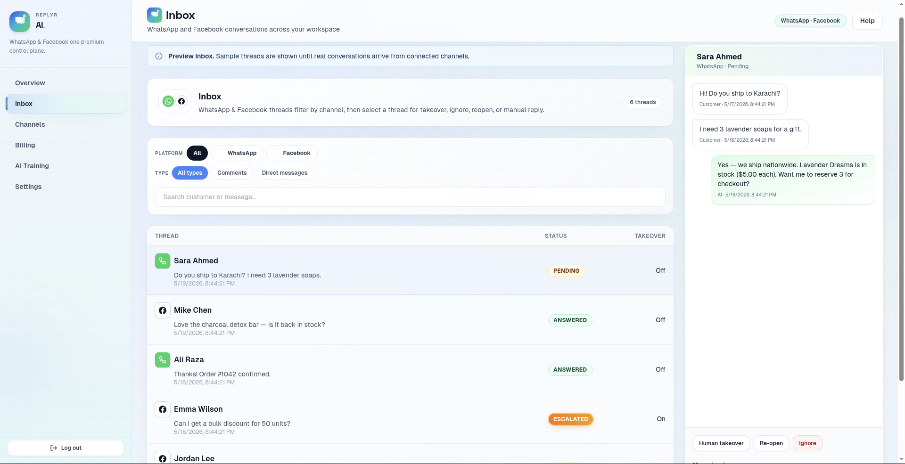
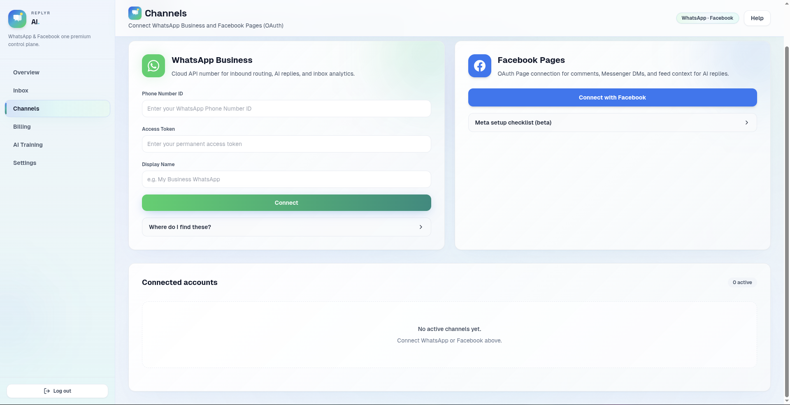

# Replyr AI

Multi-tenant SaaS for AI-powered replies on Facebook, Instagram, WhatsApp, and TikTok.

## What this project is about

Replyr AI is a full-stack workspace for businesses to receive customer messages, automate replies with AI, and manage channels, billing, and training data from one dashboard.

It combines:

- inbound message ingestion from Meta platforms (WhatsApp Business Cloud API and Facebook Pages)
- webhook processing, deduplication, and conversation routing
- AI reply generation using OpenRouter plus organization knowledge
- manual takeover, ignore, and reply controls in a unified inbox
- channel connection for WhatsApp and Facebook in the dashboard
- Stripe checkout, customer portal, and plan management with webhook sync
- AI training document upload to improve reply accuracy
- business hours, escalation keywords, reply tone, and reply timing control

The app ships with demo / preview data when channels are not connected or billing is in demo mode, so the UI still shows realistic screens during local development.

## How it works

1. **Local development & startup**
   - `./start.sh` launches Docker Postgres, Redis, backend API, Celery worker, and Next.js frontend.
   - The frontend uses Clerk for auth, and the backend uses FastAPI for API routes.

2. **Channel connect**
   - WhatsApp uses the Cloud API and manual credential input.
   - Facebook Pages uses OAuth and webhooks for comments and Messenger DMs.
   - Connected channels are stored encrypted and show live webhook health in the dashboard.

3. **Webhook ingestion**
   - Incoming Meta webhook events hit `/webhooks/meta` or `/api/v1/billing/webhook`.
   - Webhooks are validated, deduped, and converted into conversations and messages.
   - Celery tasks can process messages asynchronously and send replies through Meta APIs.

4. **AI reply pipeline**
   - Business knowledge and organization settings are loaded for each org.
   - The AI agent builds an OpenRouter prompt with product data, tone, language, and context.
   - AI-generated replies can be sent automatically or held for manual takeover.

5. **AI training**
   - The dashboard uploads PDF/Excel/CSV documents as knowledge sources.
   - Uploaded documents are parsed, processed, and made available to the AI reply engine.

6. **Billing & subscription**
   - Stripe Checkout and Customer Portal are integrated in Phase 4.
   - Stripe webhooks sync plan changes back to the local org subscription tier.
   - The dashboard shows invoices, usage, and a billing quota banner.

7. **Dashboard UI**
   - Overview shows cross-channel metrics and activity trends.
   - Inbox shows conversational threads, status, and takeover controls.
   - Channels lets you connect/manage WhatsApp and Facebook accounts.
   - Billing shows plan, invoices, and Stripe billing actions.
   - AI Training lets you add business documents to improve reply accuracy.
   - Settings controls business profile, AI voice, reply timing, hours, and escalation rules.

## UI preview gallery

### Homepage screenshots

1. Homepage 1
   
2. Homepage 2
   
3. Homepage 3
   
4. Homepage 4
   
5. Homepage 5
   
6. Homepage 6
   
7. Homepage 7
   
8. Homepage 8
   
9. Homepage 9
   
10. Homepage 10
    

### Dashboard screenshots

- Overview
  
  
- Inbox
  
- Channels
  
- Billing
  
  
- AI Training
  
- Contact Us
  

## Stack

- **Frontend:** Next.js 14 (App Router), TypeScript, Tailwind CSS, Clerk
- **Backend:** Python 3.11, FastAPI, SQLAlchemy 2, Alembic, Celery, Redis
- **Database:** PostgreSQL 16

## Local development

**Recommended (API + UI on your machine):** see **[docs/PHASE1.md](docs/PHASE1.md)**.

```bash
./start.sh
# or: bash scripts/start.sh
```

That one script starts Postgres (Docker), runs migrations, Celery, API, and Next.js. Press **Ctrl+C** to stop all of them.

Optional: `bash scripts/phase1-verify.sh` to health-check.

### WhatsApp (Phase 2)

See **[docs/PHASE2.md](docs/PHASE2.md)** — Meta webhook, Channels connect, `bash scripts/tunnel.sh`, `python3 scripts/test_whatsapp_flow.py`.

### Facebook Pages (Phase 3 beta)

See **[docs/PHASE3.md](docs/PHASE3.md)** — OAuth, Page webhooks, `python3 scripts/test_facebook_flow.py`, `bash scripts/phase3-verify.sh`.

### Stripe billing (Phase 4)

See **[docs/PHASE4.md](docs/PHASE4.md)** — Products/prices, webhook at `/api/v1/billing/webhook`, `NEXT_PUBLIC_BILLING_DEMO=false`, `bash scripts/phase4-verify.sh`.

Without Clerk keys, use **Continue to dashboard** on sign-in (dev auth + `POST /auth/dev-bootstrap`).

### Docker Compose (all services in containers)

1. Copy `backend/.env.example` → `backend/.env` (use `postgres` / `redis` hostnames).
2. `docker compose up --build`

- API: http://localhost:8000  
- API health: http://localhost:8000/health  
- Frontend: http://localhost:3000  

## Project layout

See `Replyr_AI_Cursor_Prompt.docx` (architecture guide) for the full specification: folder structure, database schema, webhooks, and implementation phases.
